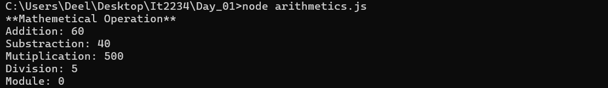
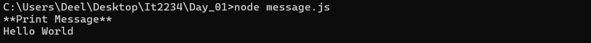
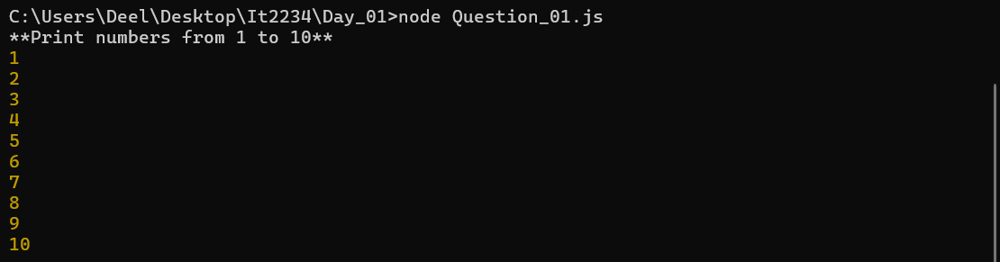
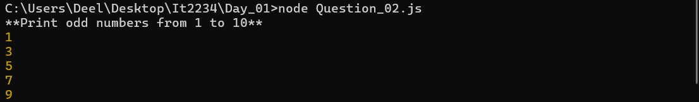
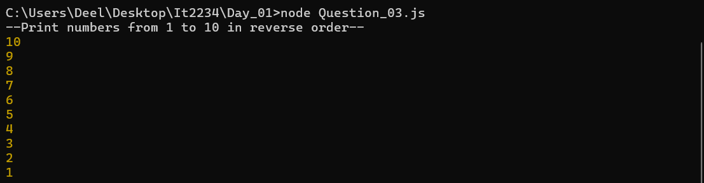
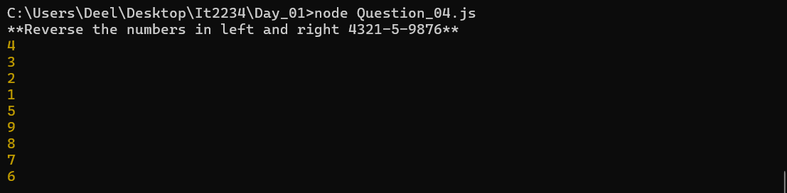

| code file | output |
|-----------|--------|
|['arithmetics.js'](./codes/arithmetics.js)||
|['message.js'](./codes/message.js)||
|['Question_01.js'](./codes/Question_01.js)||
 |['Question_02.js'](./codes/Question_02.js)||
 |['Question_03.js'](./codes/Question_03.js)||
 |['Question_04.js'](./codes/Question_04.js)||
