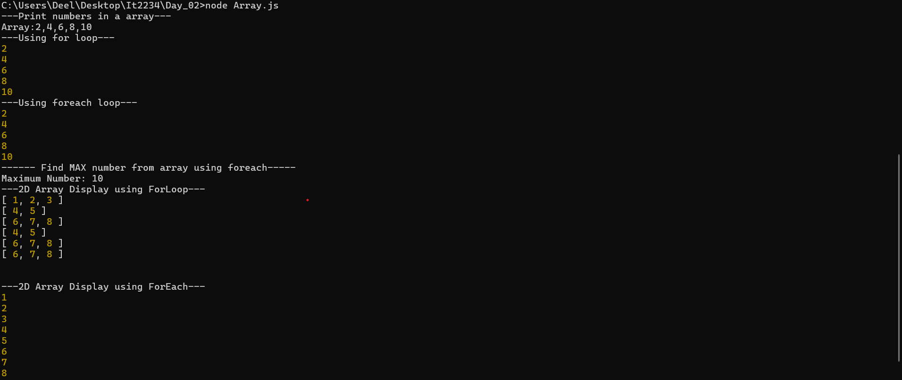
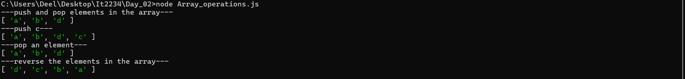
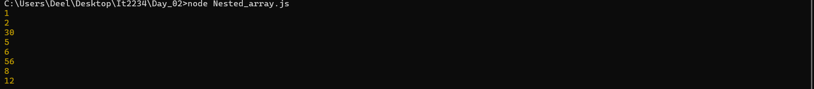
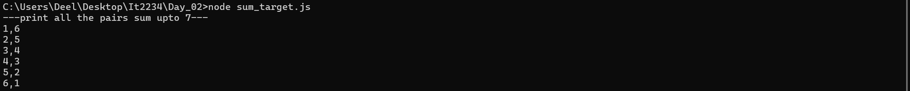
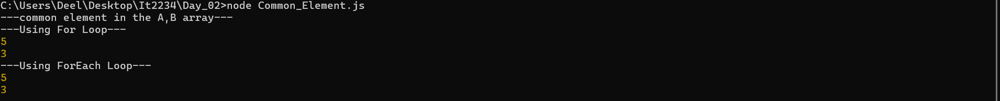
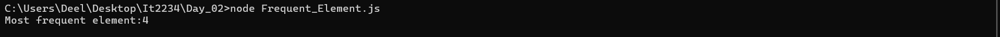
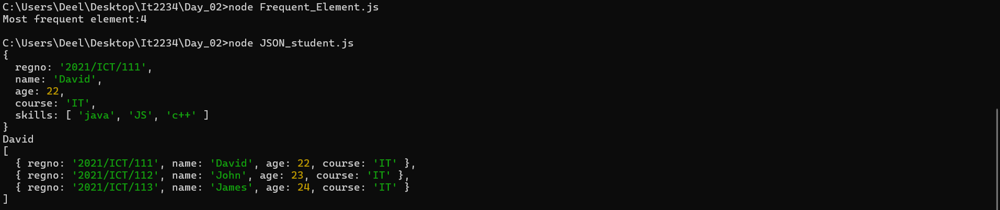
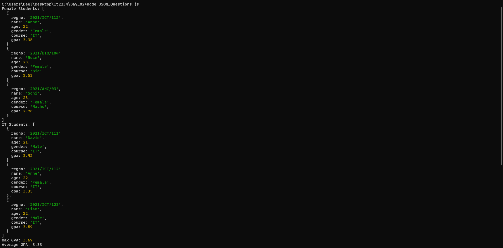

| code file | output |
|-----------|--------|
|['Array.js'](./Codes/Array.js)||
|['Array_operations.js'](./Codes/Array_operations.js)||
|['Nested_array.js'](./Codes/Nested_array.js)||
|['sum_target.js'](./Codes/sum_target.js)||
|['Common_Element.js'](./Codes/Common_Element.js)||
|['Frequent_Element.js'](./Codes/Frequent_Element.js)||
|['Array_operations.js'](./Codes/Array_operations.js)||
|['JSON_student.js'](./Codes/JSON_student.js)||
|['JSON_Questions.js'](./Codes/JSON_Questions.js)||
