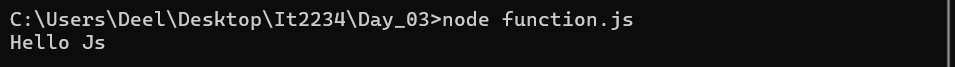
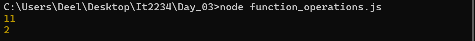
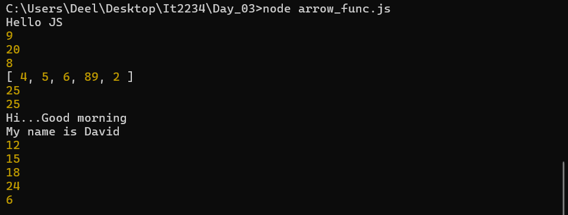
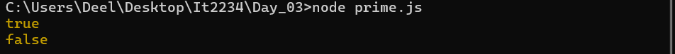
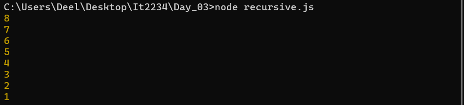

| code file | output |
|-----------|--------|
|['function.js'](./Codes/Array.js)||
|['function_operations.js'](./Codes/function_operations.js)||
|['arrow_func.js'](./Codes/arrow_func.js)||
|['prime.js'](./Codes/prime.js)||
|['recursive.js'](./Codes/recursive.js)||
