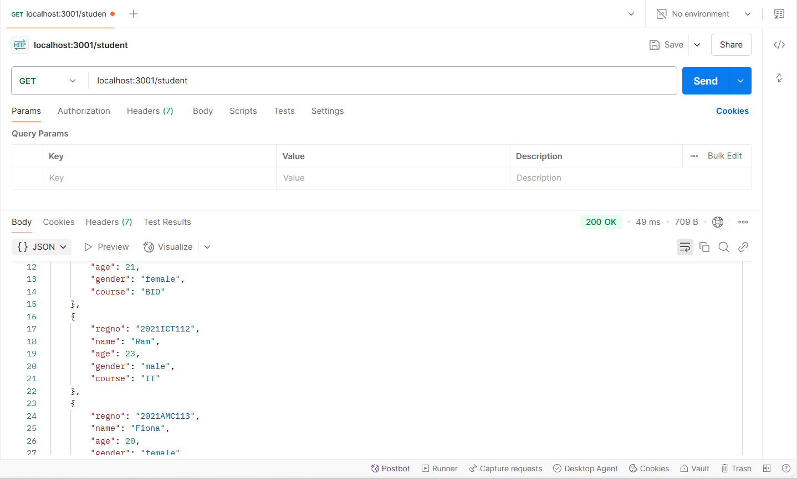
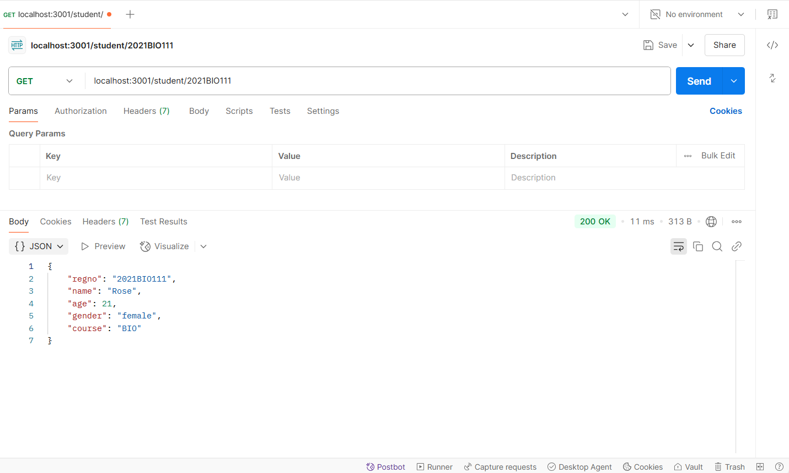
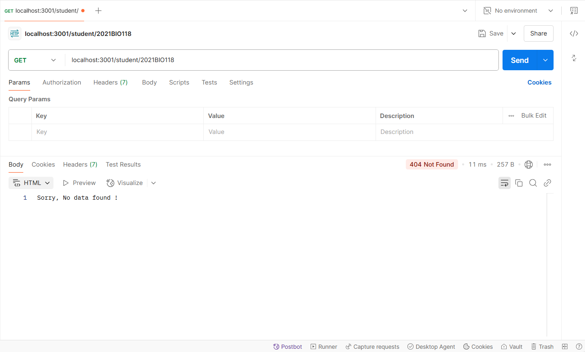
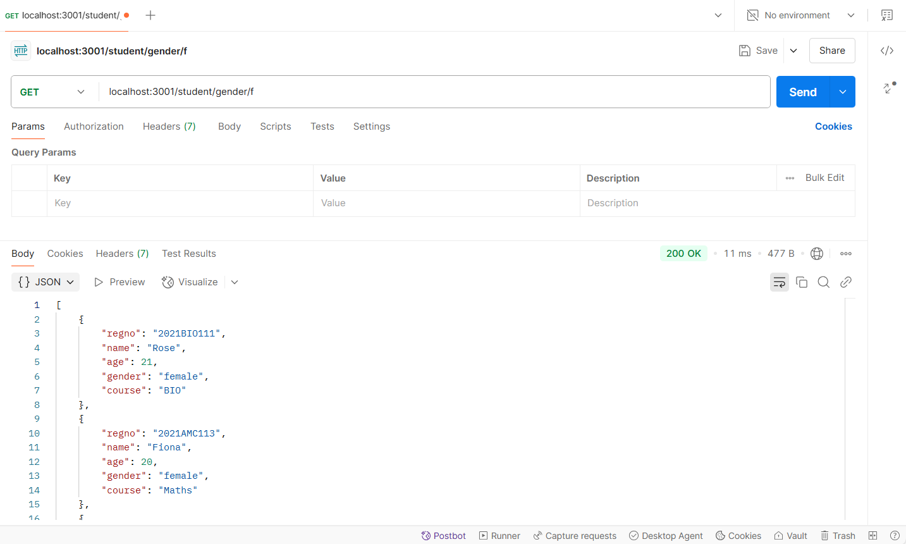
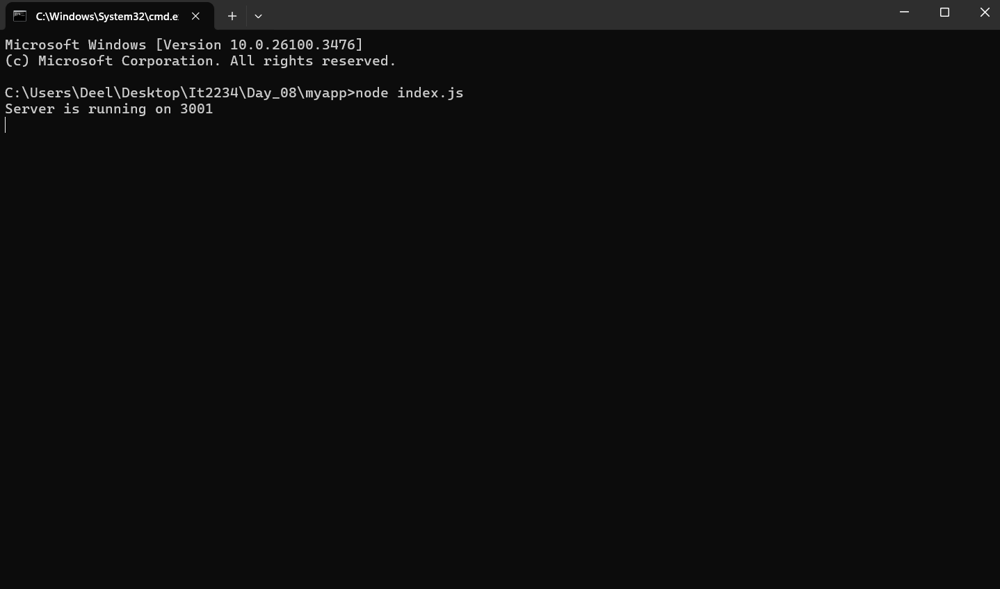

| code file | output |
|-----------|--------|
|['index.js'](./Codes/index.js) ['studentdb.js'](./Codes/studentdb.js) ['studentroute.js'](./Codes/studentroute.js) ['studentservice.js'](./Codes/studentservice.js) |     |
